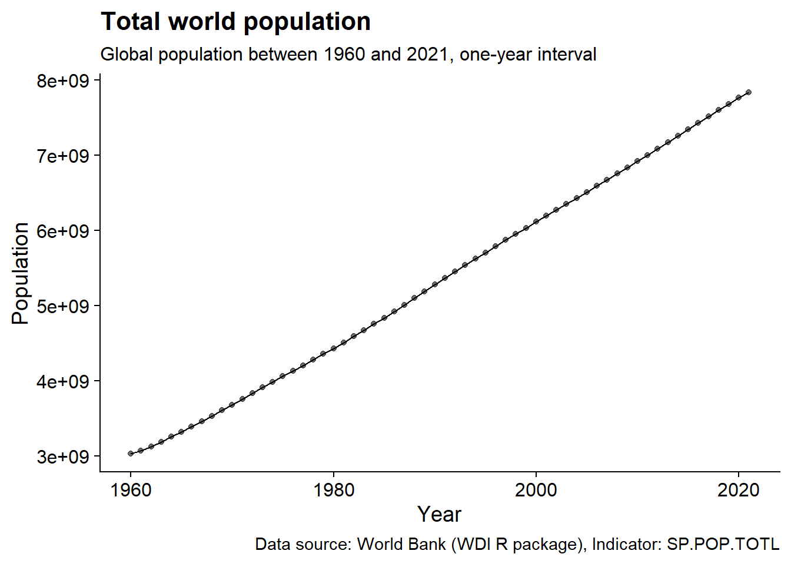
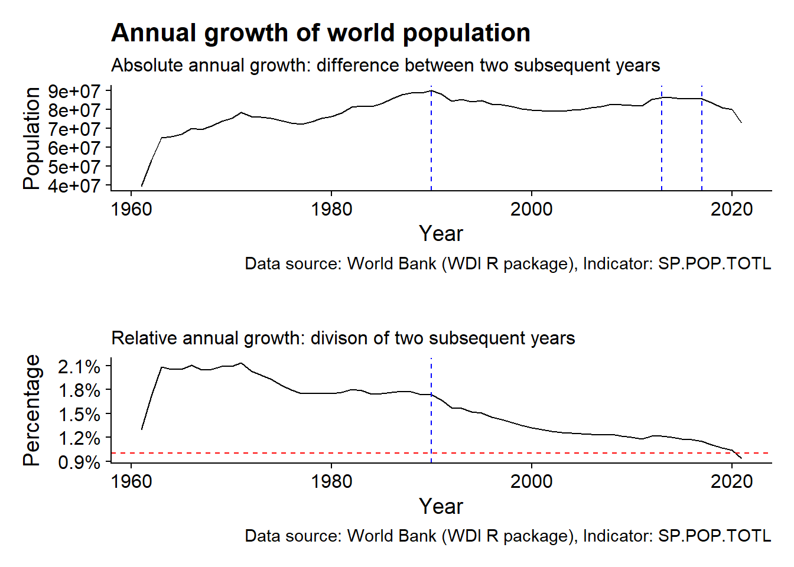
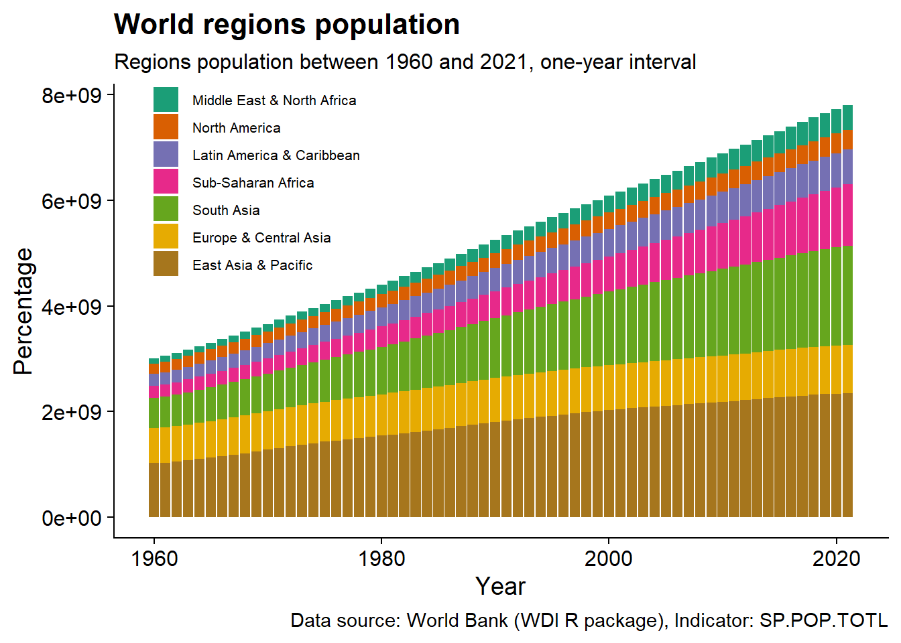
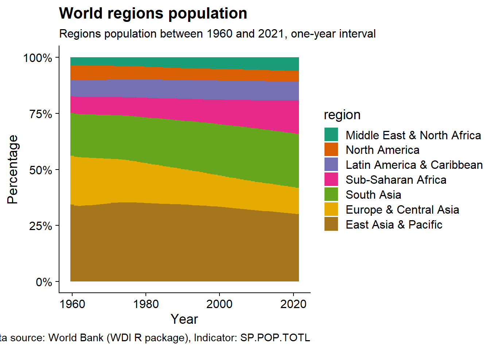
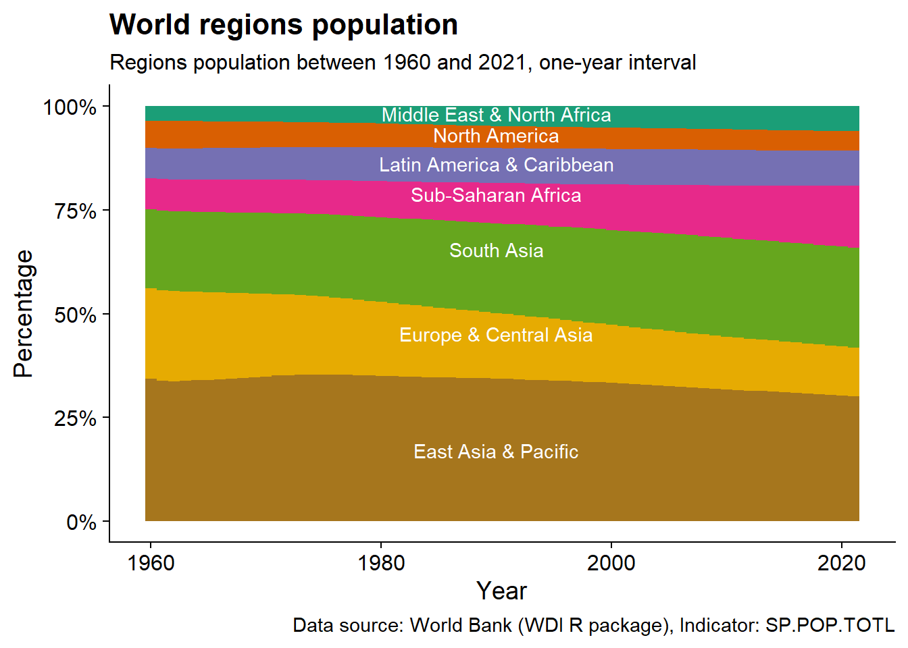
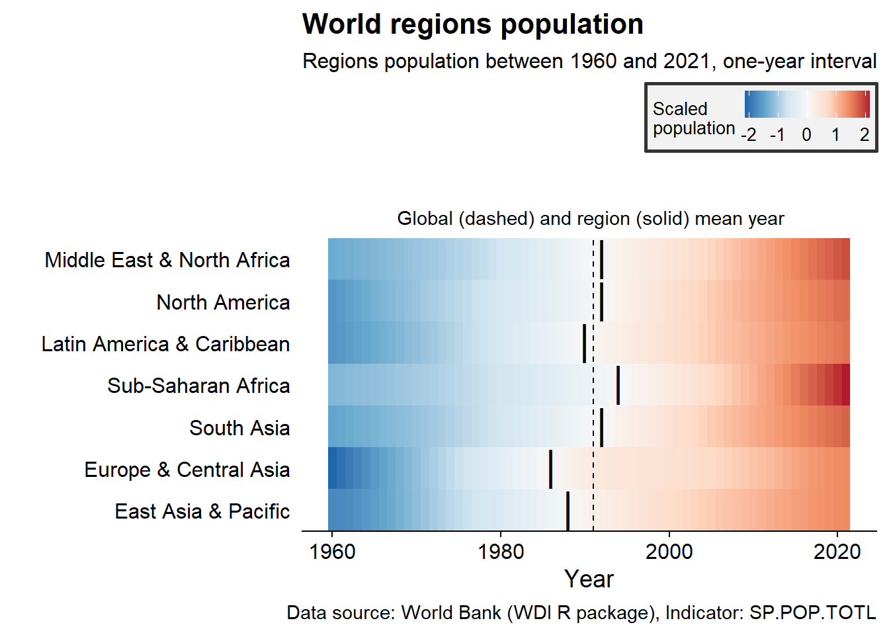
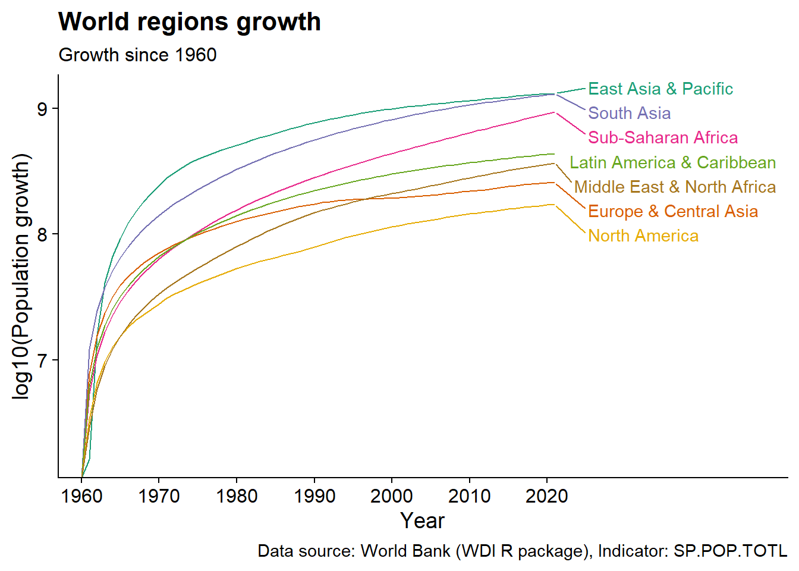
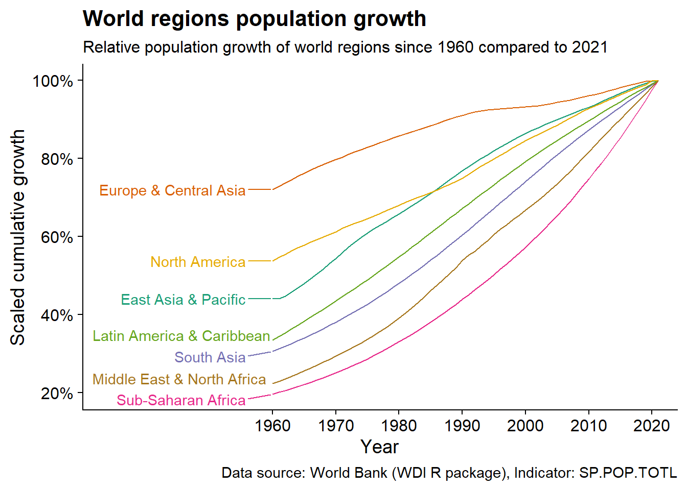
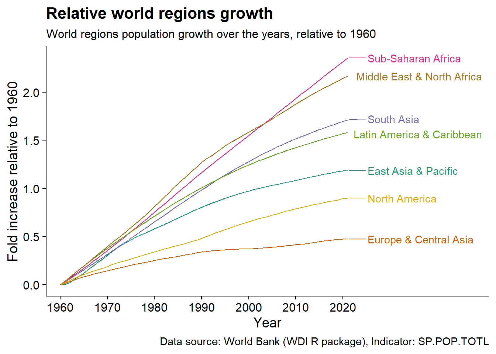

```
## ── Attaching packages ─────────────────────────────────────── tidyverse 1.3.1 ──
```

```
## ✔ ggplot2 3.4.0      ✔ purrr   0.3.5 
## ✔ tibble  3.1.8      ✔ dplyr   1.0.10
## ✔ tidyr   1.2.0      ✔ stringr 1.4.1 
## ✔ readr   2.1.2      ✔ forcats 0.5.1
```

```
## Warning: package 'ggplot2' was built under R version 4.2.2
```

```
## Warning: package 'tibble' was built under R version 4.2.2
```

```
## Warning: package 'purrr' was built under R version 4.2.2
```

```
## Warning: package 'dplyr' was built under R version 4.2.2
```

```
## Warning: package 'stringr' was built under R version 4.2.2
```

```
## ── Conflicts ────────────────────────────────────────── tidyverse_conflicts() ──
## ✖ dplyr::filter() masks stats::filter()
## ✖ dplyr::lag()    masks stats::lag()
```

```
## Warning: package 'magrittr' was built under R version 4.2.2
```

```
## 
## Attaching package: 'magrittr'
```

```
## The following object is masked from 'package:purrr':
## 
##     set_names
```

```
## The following object is masked from 'package:tidyr':
## 
##     extract
```

```
## Warning: package 'patchwork' was built under R version 4.2.2
```

# World population

Exploratory data analysis of total world population, regions, and countries.

Where can one find data on world population? Many!

Primary sources:

-   [International Database (IDB)](https://www.census.gov/data-tools/demo/idb/#/country?COUNTRY_YEAR=2022&COUNTRY_YR_ANIM=2022) from the United States Census Bureau provides population estimates and projections for 227 countries and areas.

-   [World Population Prospects 2022](https://population.un.org/wpp/) from the United Nations is the latest assessment considers the results of 1,758 national population censuses conducted between 1950 and 2022.

-   [World Bank](https://data.worldbank.org/indicator/SP.POP.TOTL) offers world population estimates from 1960 to 2021.

Secondary sources:

-   [Gapminder](https://www.gapminder.org/data/documentation/gd003/) foundation collects data from different resources on world population from 1800 to 2100.

-   [Our World in Data](https://ourworldindata.org/world-population-growth) brings together the most reliable and informative data sets.

Live population clocks:

-   [worldmeters](https://www.worldometers.info/world-population/)

-   [International Database from the US Census Bureau.](https://www.census.gov/popclock/world/)

R interface:

-   [Gapminder](#https://rdrr.io/cran/gapminder/) package in R is a limited excerpt until 2017.

-   [WDI](https://github.com/vincentarelbundock/WDI) package allows users to search and download data from over 40 datasets hosted by the World Bank.

Miscellaneous:

-   A [collection](https://cengel.github.io/gearup2016/SULdataAccess.html) of updated resources for accessing social science data on various topics from R.

## Data collection

In this tutorial I'll be retrieve data and metadata from [World Bank](https://data.worldbank.org/indicator/SP.POP.TOTL) on world popoulation between 1960 and 2021 [WDI](https://github.com/vincentarelbundock/WDI) package.

We start by loading the population data and countries metadata from World Bank.


```r
#population data
country_pop <- WDI::WDI(indicator='SP.POP.TOTL',
                        start=1960,
                        end=2022)
#metadata
country_meta <- WDI::WDI_data$country
```

Now let's have a brief look on these two large tables.

```r
#data table
glimpse(country_pop)
```

```
## Rows: 16,492
## Columns: 5
## $ country     <chr> "Africa Eastern and Southern", "Africa Eastern and Souther…
## $ iso2c       <chr> "ZH", "ZH", "ZH", "ZH", "ZH", "ZH", "ZH", "ZH", "ZH", "ZH"…
## $ iso3c       <chr> "AFE", "AFE", "AFE", "AFE", "AFE", "AFE", "AFE", "AFE", "A…
## $ year        <int> 2021, 2020, 2019, 2018, 2017, 2016, 2015, 2014, 2013, 2012…
## $ SP.POP.TOTL <dbl> 694665117, 677243299, 660046272, 643090131, 626392880, 609…
```

```r
gt::gt(head(country_pop))
```

```{=html}
<div id="qdktedogyi" style="overflow-x:auto;overflow-y:auto;width:auto;height:auto;">
<style>html {
  font-family: -apple-system, BlinkMacSystemFont, 'Segoe UI', Roboto, Oxygen, Ubuntu, Cantarell, 'Helvetica Neue', 'Fira Sans', 'Droid Sans', Arial, sans-serif;
}

#qdktedogyi .gt_table {
  display: table;
  border-collapse: collapse;
  margin-left: auto;
  margin-right: auto;
  color: #333333;
  font-size: 16px;
  font-weight: normal;
  font-style: normal;
  background-color: #FFFFFF;
  width: auto;
  border-top-style: solid;
  border-top-width: 2px;
  border-top-color: #A8A8A8;
  border-right-style: none;
  border-right-width: 2px;
  border-right-color: #D3D3D3;
  border-bottom-style: solid;
  border-bottom-width: 2px;
  border-bottom-color: #A8A8A8;
  border-left-style: none;
  border-left-width: 2px;
  border-left-color: #D3D3D3;
}

#qdktedogyi .gt_heading {
  background-color: #FFFFFF;
  text-align: center;
  border-bottom-color: #FFFFFF;
  border-left-style: none;
  border-left-width: 1px;
  border-left-color: #D3D3D3;
  border-right-style: none;
  border-right-width: 1px;
  border-right-color: #D3D3D3;
}

#qdktedogyi .gt_title {
  color: #333333;
  font-size: 125%;
  font-weight: initial;
  padding-top: 4px;
  padding-bottom: 4px;
  padding-left: 5px;
  padding-right: 5px;
  border-bottom-color: #FFFFFF;
  border-bottom-width: 0;
}

#qdktedogyi .gt_subtitle {
  color: #333333;
  font-size: 85%;
  font-weight: initial;
  padding-top: 0;
  padding-bottom: 6px;
  padding-left: 5px;
  padding-right: 5px;
  border-top-color: #FFFFFF;
  border-top-width: 0;
}

#qdktedogyi .gt_bottom_border {
  border-bottom-style: solid;
  border-bottom-width: 2px;
  border-bottom-color: #D3D3D3;
}

#qdktedogyi .gt_col_headings {
  border-top-style: solid;
  border-top-width: 2px;
  border-top-color: #D3D3D3;
  border-bottom-style: solid;
  border-bottom-width: 2px;
  border-bottom-color: #D3D3D3;
  border-left-style: none;
  border-left-width: 1px;
  border-left-color: #D3D3D3;
  border-right-style: none;
  border-right-width: 1px;
  border-right-color: #D3D3D3;
}

#qdktedogyi .gt_col_heading {
  color: #333333;
  background-color: #FFFFFF;
  font-size: 100%;
  font-weight: normal;
  text-transform: inherit;
  border-left-style: none;
  border-left-width: 1px;
  border-left-color: #D3D3D3;
  border-right-style: none;
  border-right-width: 1px;
  border-right-color: #D3D3D3;
  vertical-align: bottom;
  padding-top: 5px;
  padding-bottom: 6px;
  padding-left: 5px;
  padding-right: 5px;
  overflow-x: hidden;
}

#qdktedogyi .gt_column_spanner_outer {
  color: #333333;
  background-color: #FFFFFF;
  font-size: 100%;
  font-weight: normal;
  text-transform: inherit;
  padding-top: 0;
  padding-bottom: 0;
  padding-left: 4px;
  padding-right: 4px;
}

#qdktedogyi .gt_column_spanner_outer:first-child {
  padding-left: 0;
}

#qdktedogyi .gt_column_spanner_outer:last-child {
  padding-right: 0;
}

#qdktedogyi .gt_column_spanner {
  border-bottom-style: solid;
  border-bottom-width: 2px;
  border-bottom-color: #D3D3D3;
  vertical-align: bottom;
  padding-top: 5px;
  padding-bottom: 5px;
  overflow-x: hidden;
  display: inline-block;
  width: 100%;
}

#qdktedogyi .gt_group_heading {
  padding-top: 8px;
  padding-bottom: 8px;
  padding-left: 5px;
  padding-right: 5px;
  color: #333333;
  background-color: #FFFFFF;
  font-size: 100%;
  font-weight: initial;
  text-transform: inherit;
  border-top-style: solid;
  border-top-width: 2px;
  border-top-color: #D3D3D3;
  border-bottom-style: solid;
  border-bottom-width: 2px;
  border-bottom-color: #D3D3D3;
  border-left-style: none;
  border-left-width: 1px;
  border-left-color: #D3D3D3;
  border-right-style: none;
  border-right-width: 1px;
  border-right-color: #D3D3D3;
  vertical-align: middle;
}

#qdktedogyi .gt_empty_group_heading {
  padding: 0.5px;
  color: #333333;
  background-color: #FFFFFF;
  font-size: 100%;
  font-weight: initial;
  border-top-style: solid;
  border-top-width: 2px;
  border-top-color: #D3D3D3;
  border-bottom-style: solid;
  border-bottom-width: 2px;
  border-bottom-color: #D3D3D3;
  vertical-align: middle;
}

#qdktedogyi .gt_from_md > :first-child {
  margin-top: 0;
}

#qdktedogyi .gt_from_md > :last-child {
  margin-bottom: 0;
}

#qdktedogyi .gt_row {
  padding-top: 8px;
  padding-bottom: 8px;
  padding-left: 5px;
  padding-right: 5px;
  margin: 10px;
  border-top-style: solid;
  border-top-width: 1px;
  border-top-color: #D3D3D3;
  border-left-style: none;
  border-left-width: 1px;
  border-left-color: #D3D3D3;
  border-right-style: none;
  border-right-width: 1px;
  border-right-color: #D3D3D3;
  vertical-align: middle;
  overflow-x: hidden;
}

#qdktedogyi .gt_stub {
  color: #333333;
  background-color: #FFFFFF;
  font-size: 100%;
  font-weight: initial;
  text-transform: inherit;
  border-right-style: solid;
  border-right-width: 2px;
  border-right-color: #D3D3D3;
  padding-left: 5px;
  padding-right: 5px;
}

#qdktedogyi .gt_stub_row_group {
  color: #333333;
  background-color: #FFFFFF;
  font-size: 100%;
  font-weight: initial;
  text-transform: inherit;
  border-right-style: solid;
  border-right-width: 2px;
  border-right-color: #D3D3D3;
  padding-left: 5px;
  padding-right: 5px;
  vertical-align: top;
}

#qdktedogyi .gt_row_group_first td {
  border-top-width: 2px;
}

#qdktedogyi .gt_summary_row {
  color: #333333;
  background-color: #FFFFFF;
  text-transform: inherit;
  padding-top: 8px;
  padding-bottom: 8px;
  padding-left: 5px;
  padding-right: 5px;
}

#qdktedogyi .gt_first_summary_row {
  border-top-style: solid;
  border-top-color: #D3D3D3;
}

#qdktedogyi .gt_first_summary_row.thick {
  border-top-width: 2px;
}

#qdktedogyi .gt_last_summary_row {
  padding-top: 8px;
  padding-bottom: 8px;
  padding-left: 5px;
  padding-right: 5px;
  border-bottom-style: solid;
  border-bottom-width: 2px;
  border-bottom-color: #D3D3D3;
}

#qdktedogyi .gt_grand_summary_row {
  color: #333333;
  background-color: #FFFFFF;
  text-transform: inherit;
  padding-top: 8px;
  padding-bottom: 8px;
  padding-left: 5px;
  padding-right: 5px;
}

#qdktedogyi .gt_first_grand_summary_row {
  padding-top: 8px;
  padding-bottom: 8px;
  padding-left: 5px;
  padding-right: 5px;
  border-top-style: double;
  border-top-width: 6px;
  border-top-color: #D3D3D3;
}

#qdktedogyi .gt_striped {
  background-color: rgba(128, 128, 128, 0.05);
}

#qdktedogyi .gt_table_body {
  border-top-style: solid;
  border-top-width: 2px;
  border-top-color: #D3D3D3;
  border-bottom-style: solid;
  border-bottom-width: 2px;
  border-bottom-color: #D3D3D3;
}

#qdktedogyi .gt_footnotes {
  color: #333333;
  background-color: #FFFFFF;
  border-bottom-style: none;
  border-bottom-width: 2px;
  border-bottom-color: #D3D3D3;
  border-left-style: none;
  border-left-width: 2px;
  border-left-color: #D3D3D3;
  border-right-style: none;
  border-right-width: 2px;
  border-right-color: #D3D3D3;
}

#qdktedogyi .gt_footnote {
  margin: 0px;
  font-size: 90%;
  padding-left: 4px;
  padding-right: 4px;
  padding-left: 5px;
  padding-right: 5px;
}

#qdktedogyi .gt_sourcenotes {
  color: #333333;
  background-color: #FFFFFF;
  border-bottom-style: none;
  border-bottom-width: 2px;
  border-bottom-color: #D3D3D3;
  border-left-style: none;
  border-left-width: 2px;
  border-left-color: #D3D3D3;
  border-right-style: none;
  border-right-width: 2px;
  border-right-color: #D3D3D3;
}

#qdktedogyi .gt_sourcenote {
  font-size: 90%;
  padding-top: 4px;
  padding-bottom: 4px;
  padding-left: 5px;
  padding-right: 5px;
}

#qdktedogyi .gt_left {
  text-align: left;
}

#qdktedogyi .gt_center {
  text-align: center;
}

#qdktedogyi .gt_right {
  text-align: right;
  font-variant-numeric: tabular-nums;
}

#qdktedogyi .gt_font_normal {
  font-weight: normal;
}

#qdktedogyi .gt_font_bold {
  font-weight: bold;
}

#qdktedogyi .gt_font_italic {
  font-style: italic;
}

#qdktedogyi .gt_super {
  font-size: 65%;
}

#qdktedogyi .gt_footnote_marks {
  font-style: italic;
  font-weight: normal;
  font-size: 75%;
  vertical-align: 0.4em;
}

#qdktedogyi .gt_asterisk {
  font-size: 100%;
  vertical-align: 0;
}

#qdktedogyi .gt_indent_1 {
  text-indent: 5px;
}

#qdktedogyi .gt_indent_2 {
  text-indent: 10px;
}

#qdktedogyi .gt_indent_3 {
  text-indent: 15px;
}

#qdktedogyi .gt_indent_4 {
  text-indent: 20px;
}

#qdktedogyi .gt_indent_5 {
  text-indent: 25px;
}
</style>
<table class="gt_table">
  
  <thead class="gt_col_headings">
    <tr>
      <th class="gt_col_heading gt_columns_bottom_border gt_left" rowspan="1" colspan="1" scope="col">country</th>
      <th class="gt_col_heading gt_columns_bottom_border gt_left" rowspan="1" colspan="1" scope="col">iso2c</th>
      <th class="gt_col_heading gt_columns_bottom_border gt_left" rowspan="1" colspan="1" scope="col">iso3c</th>
      <th class="gt_col_heading gt_columns_bottom_border gt_right" rowspan="1" colspan="1" scope="col">year</th>
      <th class="gt_col_heading gt_columns_bottom_border gt_right" rowspan="1" colspan="1" scope="col">SP.POP.TOTL</th>
    </tr>
  </thead>
  <tbody class="gt_table_body">
    <tr><td class="gt_row gt_left">Africa Eastern and Southern</td>
<td class="gt_row gt_left">ZH</td>
<td class="gt_row gt_left">AFE</td>
<td class="gt_row gt_right">2021</td>
<td class="gt_row gt_right">694665117</td></tr>
    <tr><td class="gt_row gt_left">Africa Eastern and Southern</td>
<td class="gt_row gt_left">ZH</td>
<td class="gt_row gt_left">AFE</td>
<td class="gt_row gt_right">2020</td>
<td class="gt_row gt_right">677243299</td></tr>
    <tr><td class="gt_row gt_left">Africa Eastern and Southern</td>
<td class="gt_row gt_left">ZH</td>
<td class="gt_row gt_left">AFE</td>
<td class="gt_row gt_right">2019</td>
<td class="gt_row gt_right">660046272</td></tr>
    <tr><td class="gt_row gt_left">Africa Eastern and Southern</td>
<td class="gt_row gt_left">ZH</td>
<td class="gt_row gt_left">AFE</td>
<td class="gt_row gt_right">2018</td>
<td class="gt_row gt_right">643090131</td></tr>
    <tr><td class="gt_row gt_left">Africa Eastern and Southern</td>
<td class="gt_row gt_left">ZH</td>
<td class="gt_row gt_left">AFE</td>
<td class="gt_row gt_right">2017</td>
<td class="gt_row gt_right">626392880</td></tr>
    <tr><td class="gt_row gt_left">Africa Eastern and Southern</td>
<td class="gt_row gt_left">ZH</td>
<td class="gt_row gt_left">AFE</td>
<td class="gt_row gt_right">2016</td>
<td class="gt_row gt_right">609978946</td></tr>
  </tbody>
  
  
</table>
</div>
```


```r
#metadata table
glimpse(country_meta)
```

```
## Rows: 299
## Columns: 9
## $ iso3c     <chr> "ABW", "AFE", "AFG", "AFR", "AFW", "AGO", "ALB", "AND", "ARB…
## $ iso2c     <chr> "AW", "ZH", "AF", "A9", "ZI", "AO", "AL", "AD", "1A", "AE", …
## $ country   <chr> "Aruba", "Africa Eastern and Southern", "Afghanistan", "Afri…
## $ region    <chr> "Latin America & Caribbean", "Aggregates", "South Asia", "Ag…
## $ capital   <chr> "Oranjestad", "", "Kabul", "", "", "Luanda", "Tirane", "Ando…
## $ longitude <chr> "-70.0167", "", "69.1761", "", "", "13.242", "19.8172", "1.5…
## $ latitude  <chr> "12.5167", "", "34.5228", "", "", "-8.81155", "41.3317", "42…
## $ income    <chr> "High income", "Aggregates", "Low income", "Aggregates", "Ag…
## $ lending   <chr> "Not classified", "Aggregates", "IDA", "Aggregates", "Aggreg…
```

```r
gt::gt(head(country_meta))
```

```{=html}
<div id="eermsmgynt" style="overflow-x:auto;overflow-y:auto;width:auto;height:auto;">
<style>html {
  font-family: -apple-system, BlinkMacSystemFont, 'Segoe UI', Roboto, Oxygen, Ubuntu, Cantarell, 'Helvetica Neue', 'Fira Sans', 'Droid Sans', Arial, sans-serif;
}

#eermsmgynt .gt_table {
  display: table;
  border-collapse: collapse;
  margin-left: auto;
  margin-right: auto;
  color: #333333;
  font-size: 16px;
  font-weight: normal;
  font-style: normal;
  background-color: #FFFFFF;
  width: auto;
  border-top-style: solid;
  border-top-width: 2px;
  border-top-color: #A8A8A8;
  border-right-style: none;
  border-right-width: 2px;
  border-right-color: #D3D3D3;
  border-bottom-style: solid;
  border-bottom-width: 2px;
  border-bottom-color: #A8A8A8;
  border-left-style: none;
  border-left-width: 2px;
  border-left-color: #D3D3D3;
}

#eermsmgynt .gt_heading {
  background-color: #FFFFFF;
  text-align: center;
  border-bottom-color: #FFFFFF;
  border-left-style: none;
  border-left-width: 1px;
  border-left-color: #D3D3D3;
  border-right-style: none;
  border-right-width: 1px;
  border-right-color: #D3D3D3;
}

#eermsmgynt .gt_title {
  color: #333333;
  font-size: 125%;
  font-weight: initial;
  padding-top: 4px;
  padding-bottom: 4px;
  padding-left: 5px;
  padding-right: 5px;
  border-bottom-color: #FFFFFF;
  border-bottom-width: 0;
}

#eermsmgynt .gt_subtitle {
  color: #333333;
  font-size: 85%;
  font-weight: initial;
  padding-top: 0;
  padding-bottom: 6px;
  padding-left: 5px;
  padding-right: 5px;
  border-top-color: #FFFFFF;
  border-top-width: 0;
}

#eermsmgynt .gt_bottom_border {
  border-bottom-style: solid;
  border-bottom-width: 2px;
  border-bottom-color: #D3D3D3;
}

#eermsmgynt .gt_col_headings {
  border-top-style: solid;
  border-top-width: 2px;
  border-top-color: #D3D3D3;
  border-bottom-style: solid;
  border-bottom-width: 2px;
  border-bottom-color: #D3D3D3;
  border-left-style: none;
  border-left-width: 1px;
  border-left-color: #D3D3D3;
  border-right-style: none;
  border-right-width: 1px;
  border-right-color: #D3D3D3;
}

#eermsmgynt .gt_col_heading {
  color: #333333;
  background-color: #FFFFFF;
  font-size: 100%;
  font-weight: normal;
  text-transform: inherit;
  border-left-style: none;
  border-left-width: 1px;
  border-left-color: #D3D3D3;
  border-right-style: none;
  border-right-width: 1px;
  border-right-color: #D3D3D3;
  vertical-align: bottom;
  padding-top: 5px;
  padding-bottom: 6px;
  padding-left: 5px;
  padding-right: 5px;
  overflow-x: hidden;
}

#eermsmgynt .gt_column_spanner_outer {
  color: #333333;
  background-color: #FFFFFF;
  font-size: 100%;
  font-weight: normal;
  text-transform: inherit;
  padding-top: 0;
  padding-bottom: 0;
  padding-left: 4px;
  padding-right: 4px;
}

#eermsmgynt .gt_column_spanner_outer:first-child {
  padding-left: 0;
}

#eermsmgynt .gt_column_spanner_outer:last-child {
  padding-right: 0;
}

#eermsmgynt .gt_column_spanner {
  border-bottom-style: solid;
  border-bottom-width: 2px;
  border-bottom-color: #D3D3D3;
  vertical-align: bottom;
  padding-top: 5px;
  padding-bottom: 5px;
  overflow-x: hidden;
  display: inline-block;
  width: 100%;
}

#eermsmgynt .gt_group_heading {
  padding-top: 8px;
  padding-bottom: 8px;
  padding-left: 5px;
  padding-right: 5px;
  color: #333333;
  background-color: #FFFFFF;
  font-size: 100%;
  font-weight: initial;
  text-transform: inherit;
  border-top-style: solid;
  border-top-width: 2px;
  border-top-color: #D3D3D3;
  border-bottom-style: solid;
  border-bottom-width: 2px;
  border-bottom-color: #D3D3D3;
  border-left-style: none;
  border-left-width: 1px;
  border-left-color: #D3D3D3;
  border-right-style: none;
  border-right-width: 1px;
  border-right-color: #D3D3D3;
  vertical-align: middle;
}

#eermsmgynt .gt_empty_group_heading {
  padding: 0.5px;
  color: #333333;
  background-color: #FFFFFF;
  font-size: 100%;
  font-weight: initial;
  border-top-style: solid;
  border-top-width: 2px;
  border-top-color: #D3D3D3;
  border-bottom-style: solid;
  border-bottom-width: 2px;
  border-bottom-color: #D3D3D3;
  vertical-align: middle;
}

#eermsmgynt .gt_from_md > :first-child {
  margin-top: 0;
}

#eermsmgynt .gt_from_md > :last-child {
  margin-bottom: 0;
}

#eermsmgynt .gt_row {
  padding-top: 8px;
  padding-bottom: 8px;
  padding-left: 5px;
  padding-right: 5px;
  margin: 10px;
  border-top-style: solid;
  border-top-width: 1px;
  border-top-color: #D3D3D3;
  border-left-style: none;
  border-left-width: 1px;
  border-left-color: #D3D3D3;
  border-right-style: none;
  border-right-width: 1px;
  border-right-color: #D3D3D3;
  vertical-align: middle;
  overflow-x: hidden;
}

#eermsmgynt .gt_stub {
  color: #333333;
  background-color: #FFFFFF;
  font-size: 100%;
  font-weight: initial;
  text-transform: inherit;
  border-right-style: solid;
  border-right-width: 2px;
  border-right-color: #D3D3D3;
  padding-left: 5px;
  padding-right: 5px;
}

#eermsmgynt .gt_stub_row_group {
  color: #333333;
  background-color: #FFFFFF;
  font-size: 100%;
  font-weight: initial;
  text-transform: inherit;
  border-right-style: solid;
  border-right-width: 2px;
  border-right-color: #D3D3D3;
  padding-left: 5px;
  padding-right: 5px;
  vertical-align: top;
}

#eermsmgynt .gt_row_group_first td {
  border-top-width: 2px;
}

#eermsmgynt .gt_summary_row {
  color: #333333;
  background-color: #FFFFFF;
  text-transform: inherit;
  padding-top: 8px;
  padding-bottom: 8px;
  padding-left: 5px;
  padding-right: 5px;
}

#eermsmgynt .gt_first_summary_row {
  border-top-style: solid;
  border-top-color: #D3D3D3;
}

#eermsmgynt .gt_first_summary_row.thick {
  border-top-width: 2px;
}

#eermsmgynt .gt_last_summary_row {
  padding-top: 8px;
  padding-bottom: 8px;
  padding-left: 5px;
  padding-right: 5px;
  border-bottom-style: solid;
  border-bottom-width: 2px;
  border-bottom-color: #D3D3D3;
}

#eermsmgynt .gt_grand_summary_row {
  color: #333333;
  background-color: #FFFFFF;
  text-transform: inherit;
  padding-top: 8px;
  padding-bottom: 8px;
  padding-left: 5px;
  padding-right: 5px;
}

#eermsmgynt .gt_first_grand_summary_row {
  padding-top: 8px;
  padding-bottom: 8px;
  padding-left: 5px;
  padding-right: 5px;
  border-top-style: double;
  border-top-width: 6px;
  border-top-color: #D3D3D3;
}

#eermsmgynt .gt_striped {
  background-color: rgba(128, 128, 128, 0.05);
}

#eermsmgynt .gt_table_body {
  border-top-style: solid;
  border-top-width: 2px;
  border-top-color: #D3D3D3;
  border-bottom-style: solid;
  border-bottom-width: 2px;
  border-bottom-color: #D3D3D3;
}

#eermsmgynt .gt_footnotes {
  color: #333333;
  background-color: #FFFFFF;
  border-bottom-style: none;
  border-bottom-width: 2px;
  border-bottom-color: #D3D3D3;
  border-left-style: none;
  border-left-width: 2px;
  border-left-color: #D3D3D3;
  border-right-style: none;
  border-right-width: 2px;
  border-right-color: #D3D3D3;
}

#eermsmgynt .gt_footnote {
  margin: 0px;
  font-size: 90%;
  padding-left: 4px;
  padding-right: 4px;
  padding-left: 5px;
  padding-right: 5px;
}

#eermsmgynt .gt_sourcenotes {
  color: #333333;
  background-color: #FFFFFF;
  border-bottom-style: none;
  border-bottom-width: 2px;
  border-bottom-color: #D3D3D3;
  border-left-style: none;
  border-left-width: 2px;
  border-left-color: #D3D3D3;
  border-right-style: none;
  border-right-width: 2px;
  border-right-color: #D3D3D3;
}

#eermsmgynt .gt_sourcenote {
  font-size: 90%;
  padding-top: 4px;
  padding-bottom: 4px;
  padding-left: 5px;
  padding-right: 5px;
}

#eermsmgynt .gt_left {
  text-align: left;
}

#eermsmgynt .gt_center {
  text-align: center;
}

#eermsmgynt .gt_right {
  text-align: right;
  font-variant-numeric: tabular-nums;
}

#eermsmgynt .gt_font_normal {
  font-weight: normal;
}

#eermsmgynt .gt_font_bold {
  font-weight: bold;
}

#eermsmgynt .gt_font_italic {
  font-style: italic;
}

#eermsmgynt .gt_super {
  font-size: 65%;
}

#eermsmgynt .gt_footnote_marks {
  font-style: italic;
  font-weight: normal;
  font-size: 75%;
  vertical-align: 0.4em;
}

#eermsmgynt .gt_asterisk {
  font-size: 100%;
  vertical-align: 0;
}

#eermsmgynt .gt_indent_1 {
  text-indent: 5px;
}

#eermsmgynt .gt_indent_2 {
  text-indent: 10px;
}

#eermsmgynt .gt_indent_3 {
  text-indent: 15px;
}

#eermsmgynt .gt_indent_4 {
  text-indent: 20px;
}

#eermsmgynt .gt_indent_5 {
  text-indent: 25px;
}
</style>
<table class="gt_table">
  
  <thead class="gt_col_headings">
    <tr>
      <th class="gt_col_heading gt_columns_bottom_border gt_left" rowspan="1" colspan="1" scope="col">iso3c</th>
      <th class="gt_col_heading gt_columns_bottom_border gt_left" rowspan="1" colspan="1" scope="col">iso2c</th>
      <th class="gt_col_heading gt_columns_bottom_border gt_left" rowspan="1" colspan="1" scope="col">country</th>
      <th class="gt_col_heading gt_columns_bottom_border gt_left" rowspan="1" colspan="1" scope="col">region</th>
      <th class="gt_col_heading gt_columns_bottom_border gt_left" rowspan="1" colspan="1" scope="col">capital</th>
      <th class="gt_col_heading gt_columns_bottom_border gt_right" rowspan="1" colspan="1" scope="col">longitude</th>
      <th class="gt_col_heading gt_columns_bottom_border gt_right" rowspan="1" colspan="1" scope="col">latitude</th>
      <th class="gt_col_heading gt_columns_bottom_border gt_left" rowspan="1" colspan="1" scope="col">income</th>
      <th class="gt_col_heading gt_columns_bottom_border gt_left" rowspan="1" colspan="1" scope="col">lending</th>
    </tr>
  </thead>
  <tbody class="gt_table_body">
    <tr><td class="gt_row gt_left">ABW</td>
<td class="gt_row gt_left">AW</td>
<td class="gt_row gt_left">Aruba</td>
<td class="gt_row gt_left">Latin America &amp; Caribbean</td>
<td class="gt_row gt_left">Oranjestad</td>
<td class="gt_row gt_right">-70.0167</td>
<td class="gt_row gt_right">12.5167</td>
<td class="gt_row gt_left">High income</td>
<td class="gt_row gt_left">Not classified</td></tr>
    <tr><td class="gt_row gt_left">AFE</td>
<td class="gt_row gt_left">ZH</td>
<td class="gt_row gt_left">Africa Eastern and Southern</td>
<td class="gt_row gt_left">Aggregates</td>
<td class="gt_row gt_left"></td>
<td class="gt_row gt_right"></td>
<td class="gt_row gt_right"></td>
<td class="gt_row gt_left">Aggregates</td>
<td class="gt_row gt_left">Aggregates</td></tr>
    <tr><td class="gt_row gt_left">AFG</td>
<td class="gt_row gt_left">AF</td>
<td class="gt_row gt_left">Afghanistan</td>
<td class="gt_row gt_left">South Asia</td>
<td class="gt_row gt_left">Kabul</td>
<td class="gt_row gt_right">69.1761</td>
<td class="gt_row gt_right">34.5228</td>
<td class="gt_row gt_left">Low income</td>
<td class="gt_row gt_left">IDA</td></tr>
    <tr><td class="gt_row gt_left">AFR</td>
<td class="gt_row gt_left">A9</td>
<td class="gt_row gt_left">Africa</td>
<td class="gt_row gt_left">Aggregates</td>
<td class="gt_row gt_left"></td>
<td class="gt_row gt_right"></td>
<td class="gt_row gt_right"></td>
<td class="gt_row gt_left">Aggregates</td>
<td class="gt_row gt_left">Aggregates</td></tr>
    <tr><td class="gt_row gt_left">AFW</td>
<td class="gt_row gt_left">ZI</td>
<td class="gt_row gt_left">Africa Western and Central</td>
<td class="gt_row gt_left">Aggregates</td>
<td class="gt_row gt_left"></td>
<td class="gt_row gt_right"></td>
<td class="gt_row gt_right"></td>
<td class="gt_row gt_left">Aggregates</td>
<td class="gt_row gt_left">Aggregates</td></tr>
    <tr><td class="gt_row gt_left">AGO</td>
<td class="gt_row gt_left">AO</td>
<td class="gt_row gt_left">Angola</td>
<td class="gt_row gt_left">Sub-Saharan Africa</td>
<td class="gt_row gt_left">Luanda</td>
<td class="gt_row gt_right">13.242</td>
<td class="gt_row gt_right">-8.81155</td>
<td class="gt_row gt_left">Lower middle income</td>
<td class="gt_row gt_left">IBRD</td></tr>
  </tbody>
  
  
</table>
</div>
```

Looks like a lot of data!
Let's dive a bit deeper and explore the data visually.


## Data Visualization

I'll start by defining a caption for plots stating the source of the data.


```r
data_caption <- "Data source: World Bank (WDI R package), Indicator: SP.POP.TOTL"
```

### Total world population

First we look at world population as a whole.
hmm, I wonder how does the world population look like over the years?


```r
country_pop %>% 
  filter(country == "World") %>% #select total world population
  ggplot(aes(year, SP.POP.TOTL))+
  geom_point(alpha = 0.56)+
  geom_line()+
  labs(x = "Year",
       y = "Population",
       title = "Total world population",
       subtitle = "Global population between 1960 and 2021, one-year interval",
       caption = data_caption)
```


The plot shows the increase world population from 3 billions to almost 8 billions between 1960 and 2021.

Let's have a better understanding of this increase by looking at the annual growth since 1960.


```r
diff_growth <- country_pop %>% 
  filter(country == "World") %>% 
  arrange(year) %>% 
  mutate(SP.POP.TOTL_diff = SP.POP.TOTL- lag(SP.POP.TOTL)) %>% #subtract each ear from the previous
  na.omit()%>% #remove 1960
  ggplot(aes(year, SP.POP.TOTL_diff))+
  geom_line()+
  geom_vline(xintercept = c(1990, 2013, 2017),
             lty = 2,
             color = "blue")+
  labs(x = "Year",
       y = "Population",
       title = "Annual growth of world population ",
       subtitle = "Absolute annual growth: difference between two subsequent years",
       caption = data_caption)+
  labs(y = "Population", x = "Year")
```
We can see that around 1990 the annual growth peaked to around 90 millions. Around 2013 the annual growth hit a plateau followed by a decreasing pattern around 2017. 

We can also study the annual population growth by looking at the relative increase rather than the absolute.

```r
rel_growth <- country_pop %>% 
  filter(country == "World") %>% 
  arrange(year) %>% 
  mutate(SP.POP.TOTL_diff = (SP.POP.TOTL-lag(SP.POP.TOTL))/lag(SP.POP.TOTL)) %>% 
  na.omit()%>%
  ggplot(aes(year, SP.POP.TOTL_diff))+
  geom_line()+
  geom_hline(yintercept = 0.01,
             lty = 2,
             color = "red")+
  geom_vline(xintercept = c(1990),
           lty = 2,
           color = "blue")+
  scale_y_continuous(labels = scales::percent_format())+
  labs(x = "Year",
       y = "Percentage",
       title = "",
       subtitle = "Relative annual growth: divison of two subsequent years",
       caption = data_caption)
```
Here we can clearly see the decrease in population growth after 1990, dropping below 1% around 2020.

Let' combine these two complementary views of the world population growth in a single plot. 


```r
diff_growth/rel_growth
```




### World regions population

Now let's shift our focus from global to regional level.

We start by adding the regions metadata.

```r
region_pop <- country_pop %>% 
  left_join(country_meta)%>% #merge data and metadata tables
  filter(region != "Aggregates") %>% #select regions
  group_by(region, year) %>%
  summarize(SP.POP.TOTL_region = sum(SP.POP.TOTL, na.rm = TRUE))%>%
  ungroup() %>% 
  mutate(year = as.integer(year))
```

```
## Joining, by = c("country", "iso2c", "iso3c")
## `summarise()` has grouped output by 'region'. You can override using the
## `.groups` argument.
```

We then order the regions based on their initial populations at 1960. This would make it easier and more organized to plot.

```r
region_order <- region_pop %>%
  slice_min(year,n = 1) %>%
  arrange(SP.POP.TOTL_region) 
```

We've previously looked at total world population over the years. Now let's look at the contribution of each region to the world population.

```r
region_pop %>%
  mutate(region = factor(region, region_order$region)) %>%
  ggplot(aes(year, SP.POP.TOTL_region, fill = region))+
  geom_col()+
  scale_fill_brewer(palette = "Dark2")+
  guides(fill = guide_legend(override.aes = list(size = 0.5)))+
  labs(x = "Year",
       y = "Percentage",
       title = "World regions population",
       subtitle = "Regions population between 1960 and 2021, one-year interval",
       caption = data_caption)+
  theme(legend.position = c(0.05,0.8),
        legend.text = element_text(size = 8),
        legend.title = element_blank())
```


The plot shows that East Asia & Pacific has the largest contribution to world population, while Middle East & North Africa and North America have the smallest.

It's easier to think of relative contribution rather than absolute.


```r
region_pop %>%
  mutate(region = factor(region, region_order$region)) %>%
  ggplot(aes(year, SP.POP.TOTL_region, fill = region))+
  geom_col(width = 1,
           position = position_fill())+
  scale_y_continuous(labels = scales::percent_format())+
  scale_fill_brewer(palette = "Dark2")+
labs(x = "Year",
       y = "Percentage",
       title = "World regions population",
       subtitle = "Regions population between 1960 and 2021, one-year interval",
       caption = data_caption)
```



I'll take this plot step further by removing the legend and annotating the each region "stratum" in the plot. To do this, first, calculate the percentage of ordered regions populations at a 1960. Then, compute the cumulative sum of the percentages. Finally, find the middle of each region layer where the text will be added.


```r
#find the mid-point of each region's layer
region_order <- region_pop %>%
  slice_min(year,n = 1) %>%
  arrange(SP.POP.TOTL_region) %>% 
  mutate(region_percent = SP.POP.TOTL_region/sum(SP.POP.TOTL_region),
         region_cum = cumsum(region_percent),
         cum_mid = region_cum-(region_percent/2))
```

Now let's look on the improved plot.

```r
region_pop %>%
  mutate(region = factor(region, region_order$region)) %>%
  ggplot(aes(year, SP.POP.TOTL_region, fill = region))+
  geom_col(width = 1,
           position = position_fill(),
           show.legend = FALSE)+
  geom_text(data = region_order,
            aes(year+30, 1-cum_mid, label = region),
            hjust = "middle",
            color = "white")+
  scale_y_continuous(labels = scales::percent_format())+
  scale_fill_brewer(palette = "Dark2")+
labs(x = "Year",
       y = "Percentage",
       title = "World regions population",
       subtitle = "Regions population between 1960 and 2021, one-year interval",
       caption = data_caption)
```



Looks pretty! It's also easier to read. We can clearly see that East Asia & Pacific has an almost constant contribution -around 30%- to world population. Europe and Sub-Saharan Africa have opposing trend in contribution with the first is first decreasing and the second increasing.

Each world region has a different pattern and magnitude of population growth.
Let's make a heatmap that highlights these differences!

We start by putting all regions on the same scale by calculating the z-score (how many standard deviation away from the mean year).


```r
region_pop <- region_pop %>%
  mutate(region = factor(region, rev(region_order$region))) %>% #maintain the order of regions in the previous plots
  group_by(region) %>% 
  mutate(SP.POP.TOTL_region_scaled = scale(SP.POP.TOTL_region)[,1]) %>% #calculate z-score
  ungroup()

global_pop_mean_year <- country_pop %>%
  filter(country == "World") %>%
  mutate(SP.POP.TOTL_region_scaled = scale(SP.POP.TOTL)[,1]) %>%
  slice_min(abs(SP.POP.TOTL_region_scaled), n=1) %$%
  year
```

Let's plot the heatmap

```r
region_pop %>% 
  ggplot(aes(year, region, fill = SP.POP.TOTL_region_scaled ))+
  geom_tile()+
  #add small bar at the average year for each region
  geom_point(data = . %>% group_by(region) %>% slice_min(abs(SP.POP.TOTL_region_scaled),n=1),
             shape = "|",
             size = 8)+
  #add line at the world average population year 
  geom_segment(aes(x = global_pop_mean_year, y = 0.5, xend = global_pop_mean_year, yend = 7.5),
               lty = 2)+
  annotate("text", x = global_pop_mean_year, y = 8, label = "Global (dashed) and region (solid) mean year ")+
  scale_y_discrete(expand = expansion(add = c(0,2)))+
  scale_fill_distiller(palette = "RdBu")+
  labs(x = "Year",
       y = "",
       fill = "Scaled\npopulation",
       title = "World regions population",
       subtitle = "Regions population between 1960 and 2021, one-year interval",
       caption = data_caption)+
  theme(axis.line.y = element_blank(),
        axis.ticks.y = element_blank(),
        #legend specification
        legend.direction = "horizontal",
        legend.position = "top",
        legend.justification="right",
        legend.key.width = unit(0.5, "cm"),
        legend.box.background = element_rect(color="grey20", linewidth=1, fill = "grey95"),
        legend.box.margin = margin(4, 4, 4, 4),
        legend.text = element_text(size = 10),
        legend.title = element_text(size = 10))
```



Few patterns pop-out. Sub-Saharan Africa and Middle East & North Africa show the largest region-specific growth. This large growth took place recently and over a short period. Europe had the smallest population at 1960 compared to other years.

Heatmaps are very useful and scalable to visualize large datasets. Neverthelss, for our small dataset, we can use look at the regions population over the years compared to 2021.


How big is the increase since 1960?


```r
region_pop %>%
  mutate(region = factor(region, rev(region_order$region))) %>%
  group_by(region) %>% 
  mutate(SP.POP.TOTL_region_start = log10(SP.POP.TOTL_region-head(SP.POP.TOTL_region,1))) %>% 
  ungroup() %>% 
  ggplot(aes(year, SP.POP.TOTL_region_start, color =  region))+
  geom_line(show.legend = FALSE)+
  ggrepel::geom_text_repel(data = . %>% filter(year == 2021),
            aes(label = region),
            force  = 0.5,
            nudge_x = 5,
            direction = "y",
            hjust = "left",
            show.legend = FALSE)+
  scale_color_brewer(palette = "Dark2")+
  scale_x_continuous(breaks = seq(1960,2020, by = 10),
                     expand = expansion(add = c(3,30)))+
  labs(x = "Year",
       y = "log10(Population growth)",
       title = "World regions growth",
       subtitle = "Growth since 1960",
       caption = data_caption)+
  theme(legend.direction = "horizontal",
        legend.position = "top",
        legend.justification="right",
        legend.key.width = unit(0.75, "cm"),
        legend.box.background = element_rect(color="grey20", linewidth=1, fill = "grey95"),
        legend.box.margin = margin(4, 4, 4, 4))
```




```r
region_pop <- region_pop %>%
  mutate(region = factor(region, rev(region_order$region))) %>%
  group_by(region) %>% 
  mutate(SP.POP.TOTL_region_perc = SP.POP.TOTL_region/tail(SP.POP.TOTL_region,1)) %>%#percentage compared to 2021 
  ungroup() 
```


```r
region_pop %>% 
  ggplot(aes(year, SP.POP.TOTL_region_perc, color =  region))+
  geom_line(show.legend = FALSE)+
  ggrepel::geom_text_repel(data = . %>% filter(year == 1960),
            aes(label = region),
            force  = 0.5,
            nudge_x = -5,
            direction = "y",
            hjust = 1,
            show.legend = FALSE)+
  scale_color_brewer(palette = "Dark2")+
  scale_y_continuous(labels = scales::percent_format())+
  scale_x_continuous(breaks = seq(1960,2020, by = 10),
                     expand = expansion(add = c(30,3)))+
  labs(x = "Year",
       y = "Scaled cumulative growth",
       title = "World regions population growth",
       subtitle = "Relative population growth of world regions since 1960 compared to 2021",
       caption = data_caption)+
  theme(legend.position = c(0.6, 0.3))
```



Europe & Central Asia population grew by only 30% since 1960 compared to Middle East & North Africa and  Sub-Saharan Africa huge 80% growth!


What is population growth relative to 1960 across world regions?


```r
region_pop %>%
  mutate(region = factor(region, rev(region_order$region))) %>%
  group_by(region) %>% 
  mutate(SP.POP.TOTL_region_start = log2(SP.POP.TOTL_region/head(SP.POP.TOTL_region,1))) %>% 
  ungroup() %>% 
  ggplot(aes(year, SP.POP.TOTL_region_start, color =  region))+
  geom_line(show.legend = FALSE)+
  ggrepel::geom_text_repel(data = . %>% filter(year == 2021),
            aes(label = region),
            force  = 0.5,
            nudge_x = 5,
            direction = "y",
            hjust = "left",
            show.legend = FALSE)+
  scale_color_brewer(palette = "Dark2")+
  scale_x_continuous(breaks = seq(1960,2020, by = 10),
                     expand = expansion(add = c(3,30)))+
  labs(x = "Year",
       y = "Fold increase relative to 1960",
       fill = "Scaled\npopulation",
       title = "Relative world regions growth",
       subtitle = "World regions population growth over the years, relative to 1960",
       caption = data_caption)+
  theme(legend.direction = "horizontal",
        legend.position = "top",
        legend.justification="right",
        legend.key.width = unit(0.75, "cm"),
        legend.box.background = element_rect(color="grey20", linewidth=1, fill = "grey95"),
        legend.box.margin = margin(4, 4, 4, 4))
```




